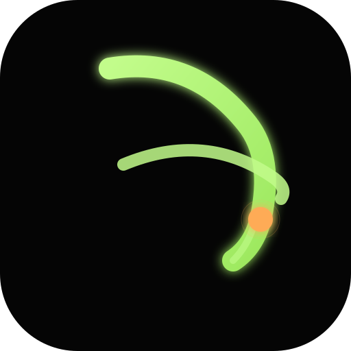

<div align="center">

  

  <h1>Kaiteyo<span style="opacity:0.5"> (書いてよ)</span></h1>

  <p><strong>Write it. Practice. Master it.</strong></p>

  <p>A premium, cross-platform Japanese language learning application.<br>
  Offline-first · Desktop-focused · Free and open source.</p>

  <br>

  
  
  
  
  

</div>

<br>

---

<br>

## What is Kaiteyo?

Kaiteyo — *"write it!"* in Japanese — is a complete immersion workspace for learning
Japanese. It started as a fork of [Kanji Dojo](https://github.com/syt0r/Kanji-Dojo) and
has grown into an independent project with its own design language, data pipeline, and
feature set.

**Desktop is the flagship.** The Windows/macOS/Linux app bundles a dictionary, media
player, sentence mining, OCR, browser, and study engine into one cohesive window. Mobile
apps share the same core learning engine (kanji, kana, vocabulary, SRS, writing practice)
via Kotlin Multiplatform.

<br>

## The Kaiteyo Workflow

Most Japanese learning tools split study into disconnected silos. Kaiteyo connects them:

```
  ┌──────────────────────────────────────────────────────────────────┐
  │  📖 Read or watch something in Japanese                         │
  │     ↓                                                           │
  │  🔍 Hover a word → dictionary popup appears instantly           │
  │     ↓                                                           │
  │  ✂️  Mine a sentence → card lands in your SRS queue             │
  │     (with screenshot + audio + timestamp)                       │
  │     ↓                                                           │
  │  🧠 Review with spaced repetition → jump back to the scene      │
  └──────────────────────────────────────────────────────────────────┘
```

Everything works **offline by default**. Your data is yours — import/export, Anki
compatibility, backup, and sync are all built in.

<br>

---

<br>

## Core Study Engine

*All platforms — Desktop, Android, iOS*

| | Feature | Status |
|---|---|---|
| ✅ | **Kanji & Kana** — JLPT N5–N1 + school-grade decks | Implemented |
| ✅ | **Vocabulary** — readings, meanings, furigana, example sentences | Implemented |
| ✅ | **Writing Practice** — stroke-order diagrams, drawing canvas, evaluation | Implemented |
| ✅ | **Spaced Repetition** — FSRS-5 scheduling, custom intervals, daily limits | Implemented |
| ✅ | **Deck Management** — create, edit, archive, duplicate, bulk actions | Implemented |
| ✅ | **Radical & Reading Search** — 6000+ characters, dictionary-backed | Implemented |
| ✅ | **Text Analysis** — word-by-word breakdown (Ichiran-style) | Implemented |
| ✅ | **Statistics & Achievements** — heatmap, curves, goals, exams | Implemented |
| ✅ | **Anki Import/Export** — `.apkg` on all platforms | Implemented |
| ✅ | **Backup & Restore** — profile archives, settings, window state | Implemented |
| 🚧 | **Sync** — GitHub device-flow + private-gist (desktop) | Partial |
| 🚧 | **Grammar Study** — explanation-first practice with starter deck | Partial |

<br>

## Desktop Suite

*Windows · macOS · Linux — the flagship experience*

| | Feature | Status |
|---|---|---|
| ✅ | **Yomitan-Style Dictionary** — import ZIP/JSON dictionaries; JMdict, KANJIDIC, KanjiVG | Implemented |
| ✅ | **Dictionary Popup** — hover/click any Japanese text for instant lookup + mining + TTS | Implemented |
| ✅ | **Media Center** — VLC / mpv / Java Sound backends; SRT/ASS/SSA/VTT subtitles | Implemented |
| ✅ | **Subtitle Mining** — sentence cards with screenshot + audio + timestamp | Implemented |
| ✅ | **Learning Browser** — reader mode, bookmarks, lookup & mining from web pages | Implemented |
| ✅ | **Local HTTP API** — bearer-token protected; media, mining, player endpoints | Implemented |
| ✅ | **AnkiConnect** — push mined cards, import decks from Anki | Implemented |
| ✅ | **Theme Studio** — HSV color wheel, gradients, presets, live preview | Implemented |
| ✅ | **Onboarding** — 8-step wizard: theme, accent, scale, font, navigation, motion | Implemented |
| ✅ | **Branded Installers** — Inno Setup, styled DMG, AppImage/deb/rpm/Flatpak/Snap | Implemented |
| ✅ | **Native Window Shell** — custom title bar, OS-native drag, resize, snap-to-edge | Implemented |
| ✅ | **Floating Launcher** — draggable bubble with snap-to-edge, mode switching | Implemented |
| ✅ | **Overlay Sidebar** — floats on content, 4 positions, elevated surface | Implemented |
| 🚧 | **OCR** — capture pipeline works; Tesseract detection when available | Partial |
| 🚧 | **Auto-Update** — architecture complete; staged rollout | Partial |
| 🚧 | **Plugin System** — registry + marketplace scaffold | Partial |

<br>

## Mobile

| | Platform | Status |
|---|---|---|
| ✅ | **Android** — Play Store + F-Droid; Firebase analytics, billing, review | Released |
| 🚧 | **iOS** — shared engine + app shell; macOS-only builds | Partial |

<br>

---

<br>

## Screenshots

<p float="left">
  
  
  
  
  
  
</p>

> Desktop screenshots: [docs/screenshots/](docs/screenshots/README.md)

<br>

---

<br>

## Downloads

<div align="center">

### Desktop

| Platform | Packages |
|:---:|---|
| **Windows** | [EXE](https://github.com/ValiantZippu/Kaiteyo/releases) · [MSI](https://github.com/ValiantZippu/Kaiteyo/releases) · Portable ZIP |
| **macOS** | [DMG](https://github.com/ValiantZippu/Kaiteyo/releases) — arm64 + x64, signed + notarized |
| **Linux** | AppImage · deb · rpm · Flatpak · Snap |

### Android

[](https://play.google.com/store/apps/details?id=ua.syt0r.kanji)
[](https://f-droid.org/en/packages/ua.syt0r.kanji.fdroid/)

### iOS

[](https://apps.apple.com/ua/app/kanji-dojo/id6745169386)

</div>

<br>

---

<br>

## Tech Stack

| Layer | Technology |
|---|---|
| **Language** | [Kotlin Multiplatform](https://kotlinlang.org/docs/multiplatform.html) 2.1.20 |
| **UI** | [Compose Multiplatform](https://www.jetbrains.com/lp/compose-multiplatform/) 1.8.2 |
| **Architecture** | Shared `core` + thin platform entry points · Screen pattern · Koin DI |
| **Data** | [SQLDelight](https://sqldelight.github.io/sqlldelight/) (dictionary + user DBs) · DataStore |
| **Networking** | [Ktor](https://ktor.io/) client · `java.net.http` for OAuth |
| **Media** | VLCJ (VLC) · mpv (JSON-RPC) · Java Sound |
| **Data Platform** | KJD — generates the offline language database from open datasets |
| **Build** | Gradle · Version catalog · JDK 17 |

<br>

---

<br>

## Development

### Prerequisites

- **JDK 17** (required)
- **Android SDK** (for Android builds)
- Network on first build (downloads app data assets)

### Quick Start

```bash
# Clone
git clone https://github.com/ValiantZippu/Kaiteyo.git
cd Kaiteyo

# Run the desktop app
./gradlew :desktopApp:run

# Japanese locale
./gradlew :desktopApp:run -Duser.language=ja -Duser.country=JP

# Compile check
./gradlew :desktopApp:compileKotlinJvm

# Run all tests
./gradlew :core:allTests

# Build installers (matching host OS only)
./gradlew :desktopApp:packageMsi    # Windows
./gradlew :desktopApp:packageDmg    # macOS
./gradlew :desktopApp:packageDeb    # Linux
```

### Project Structure

```
Kaiteyo/
├── core/               Shared KMP code — study engine, UI, data layer (all platforms)
├── desktopApp/         Desktop shell + suite (dictionary, media, mining, OCR, sync)
├── app/                Android entry point (googlePlay + fdroid flavors)
├── iosApp/             iOS entry point (Swift host + Compose UI)
├── kjd/                KJD — Japanese Data Platform (ingests datasets → DB)
├── mediaGenerator/     JVM utility for generating media assets
├── installer/          Branded installer subsystem (Inno Setup, DMG, AppImage, …)
├── website/            Static project website (Python build)
├── buildSrc/           Gradle build logic (AppVersion, AppAssets)
├── docs/               Full documentation (organized like a doc site)
└── tools/cli/          Developer CLI — kaiteyo (git, gradle, doctor, …)
```

### Branching

```
main         → production-ready (releases only)
└── develop  → default branch, integration target
     ├── early-develop  → active development
     ├── feature/*      → new features
     ├── fix/*          → bug fixes
     └── docs/*         → documentation
```

<br>

---

<br>

## Documentation

The full docs live in [`docs/`](docs/README.md), organized as a navigable documentation site.

| | Area | Link |
|---|---|---|
| 📖 | **Documentation Index** | [`docs/README.md`](docs/README.md) |
| 📦 | **Product Blueprint** | [`docs/product/PRODUCT.md`](docs/product/PRODUCT.md) |
| 🏛️ | **Architecture** | [`docs/architecture/OVERVIEW.md`](docs/architecture/OVERVIEW.md) |
| 🎨 | **Design System** | [`docs/design/README.md`](docs/design/README.md) |
| 🧠 | **Features** | [`docs/features/FEATURES.md`](docs/features/FEATURES.md) |
| 🗺️ | **Roadmap** | [`docs/roadmap/ROADMAP.md`](docs/roadmap/ROADMAP.md) |
| 🎮 | **Game (Journey)** | [`docs/game/README.md`](docs/game/README.md) |
| 🔌 | **Integrations** | [`docs/integrations/README.md`](docs/integrations/README.md) |
| 👤 | **User Guide** | [`docs/user-guide/README.md`](docs/user-guide/README.md) |
| ⚙️ | **Development** | [`docs/development/DEVELOPER_GUIDE.md`](docs/development/DEVELOPER_GUIDE.md) |
| 🧪 | **Testing** | [`docs/testing/README.md`](docs/testing/README.md) |
| 📊 | **Current State** | [`docs/planning/CURRENT_STATE.md`](docs/planning/CURRENT_STATE.md) |
| 🤖 | **AI Agent Guide** | [`docs/ai/AI_AGENT_GUIDE.md`](docs/ai/AI_AGENT_GUIDE.md) |
| ⌨️ | **Developer CLI** | [`docs/cli/README.md`](docs/cli/README.md) |
| 📦 | **Release Process** | [`docs/releases/RELEASE_PROCESS.md`](docs/releases/RELEASE_PROCESS.md) |
| 🔐 | **Security** | [`SECURITY.md`](SECURITY.md) |
| ⚖️ | **Legal & Attribution** | [`docs/legal/README.md`](docs/legal/README.md) |
| 🐞 | **Known Issues** | [`docs/planning/CURRENT_ISSUES.md`](docs/planning/CURRENT_ISSUES.md) |
| 📜 | **Changelog** | [`CHANGELOG.md`](CHANGELOG.md) |

<br>

---

<br>

## Contributing

Contributions welcome — code, docs, design, data, translations.

1. Read [`CONTRIBUTING.md`](CONTRIBUTING.md)
2. Check [`docs/planning/CURRENT_ISSUES.md`](docs/planning/CURRENT_ISSUES.md) for open issues
3. Read [`docs/development/CODING_STANDARDS.md`](docs/development/CODING_STANDARDS.md)
4. Read [`docs/development/AI_CONTEXT.md`](docs/development/AI_CONTEXT.md)

```bash
# Fork → clone → branch from develop
git checkout -b feature/my-feature

# Make changes, verify
./gradlew :desktopApp:compileKotlinJvm
./gradlew :core:allTests

# Commit with conventional format
git commit -m "feat: add my feature"

# Push and open a PR targeting develop
git push origin feature/my-feature
```

<br>

---

<br>

## Data Attribution

Kaiteyo bundles openly licensed Japanese-language datasets. Original code and third-party
data remain distinct.

| Dataset | License |
|---|---|
| [KanjiVG](https://kanjivg.tagaini.net/) — stroke order | CC BY-SA 3.0 |
| [KANJIDIC](https://www.edrdg.org/kanjidic/kanjdicindex.html) — character info | CC BY-SA 3.0 |
| [JMdict](https://www.edrdg.org/jmdict/j_jmdict.html) — dictionary | CC BY-SA 4.0 |
| [JmdictFurigana](https://github.com/Doublevil/JmdictFurigana) | CC BY-SA 4.0 |
| [Tanos JLPT lists](http://www.tanos.co.uk/jlpt/) | CC BY 3.0 |
| [Leeds frequency data](https://corpus.leeds.ac.uk/list.html) | CC BY 2.5 |
| [yomichan-jlpt-vocab](https://github.com/stephenmk/yomichan-jlpt-vocab) | CC BY-SA 4.0 |

> Full provenance: [`docs/data/SOURCES.md`](docs/data/SOURCES.md)

<br>

---

<br>

## License

Kaiteyo is free software licensed under the **GNU General Public License v3.0**
(or, at your option, any later version). See [`LICENSE`](LICENSE).

> © 2022–2023 Yaroslav Shuliak (original Kanji Dojo). Kaiteyo is a fork of Kanji Dojo,
> independently developed with its own design language, branding, and feature set.
>
> This program is distributed in the hope that it will be useful, but **WITHOUT ANY
> WARRANTY**; without even the implied warranty of MERCHANTABILITY or FITNESS FOR A
> PARTICULAR PURPOSE. See the GNU General Public License for more details.

<br>

<div align="center">

  <sub>Built with Kotlin · Compose · Compose Multiplatform</sub>

</div>
