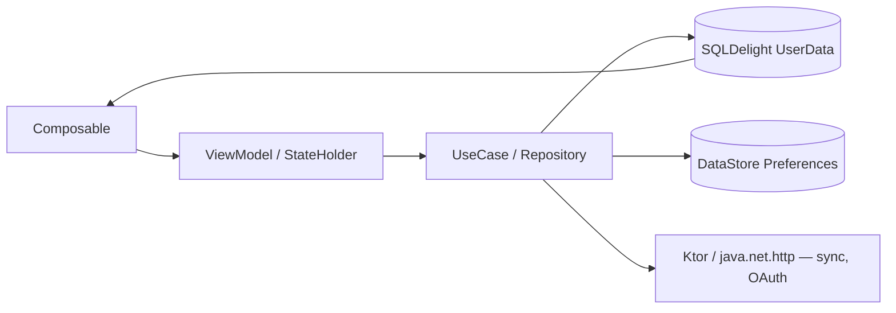

# Kaiteyo (書いてよ) — Architecture Overview

Kaiteyo is a Kotlin Multiplatform (KMP) project with **one shared `core` module** and thin
platform entry points, plus a desktop-only immersion suite and a standalone data platform.

## Module map

```
settings.gradle.kts  →  :app  :iosApp  :desktopApp  :core  :mediaGenerator  :kjd
```

| Module | Role | Platforms |
|---|---|---|
| `core/` | **All shared code**: UI (Compose MPP), business logic, data layer. `commonMain` / `jvmMain` / `androidMain` / `iosMain` | all |
| `desktopApp/` | Thin JVM wrapper: window shell, Koin init — **plus** the standalone desktop suite (`ua.syt0r.kanji.desktop.*`), JVM-only | Windows/macOS/Linux |
| `app/` | Android entry point. Flavors: `googlePlay` (Firebase, billing, review), `fdroid` | Android |
| `iosApp/` | iOS entry point (Swift project + Compose host) | iOS |
| `kjd/` | **KJD** — Kaiteyo Japanese Data Platform: standalone JVM module that ingests open datasets and generates the bundled language database | build-time |
| `mediaGenerator/` | JVM utility (javacv + coil) generating media assets | build-time |
| `buildSrc/` | Gradle logic: `AppVersion.kt`, `AppAssets.kt`, asset prepare tasks | build-time |
| `installer/` | Branded installer subsystem (scripts/configs, **not** a Gradle module) — wraps `:desktopApp:createDistributable` bundles | packaging |
| `website/` | Static site, Python build — unrelated to the Kotlin build | — |

## Dependency direction

```
        ┌───────────────────────────────────────────────┐
        │  desktopApp (window shell + desktop suite)     │
        │  ├── depends on :core (engine, UI, jdata)      │
        │  └── depends on :kjd (patch apply, DatabasePatcher) │
        └──────────────────────┬────────────────────────┘
                               │
        ┌──────────────────────▼──────────────┐
        │  app (Android)        iosApp (iOS)   │
        │  └── depends on :core └── depends on :core │
        └──────────────┬───────────────────────┘
                       ▼
                    :core  ← shared engine, UI, data layer
                       ▲
                       │ (build-time)
                    :kjd  → generates AppDataDatabase asset
```

## Package layout (everything under `ua.syt0r.kanji` in core)

```
core/src/commonMain/kotlin/ua/syt0r/kanji/
├── presentation/            # UI: KaiteyoApp (root), common/ (theme, resources, ui),
│                            # screen/main/ (app shell, navigation, feature screens)
├── core/                    # Data layer
│   ├── app_data/            # Read-only dictionary DB (SQLDelight AppDataDatabase)
│   ├── user_data/           # Mutable user DB (SQLDelight UserDataDatabase) + migrations
│   ├── srs/                 # FSRS scheduling, SRS managers (fsrs/ subpackage)
│   ├── sync/                # Sync engine + GitHub cloud provider
│   ├── account/             # GitHub OAuth (device flow)
│   ├── statistics/          # Statistics engine (heatmap, exams, retention, …)
│   ├── transfer/            # Import/export pipeline (JSON/CSV/TSV/TXT + Anki .apkg)
│   ├── backup/              # Backup/restore
│   ├── stroke_evaluator/    # Kanji stroke evaluation
│   ├── tts/                 # Kana TTS (Neural2B voices)
│   └── theme_manager/       # Theme persistence
└── di/                      # Koin modules (AppModule, PlatformComponentsModule, …)
```

The desktop suite lives at `desktopApp/src/jvmMain/kotlin/ua/syt0r/kanji/desktop/`
(JVM-only) with its own layers:

```
desktop/
├── appstate/       # AppState facade, WorkspacePanels
├── engine/         # dictionary, media, mining, ocr, browser, review, srs, sync, transfer,
│                   # theming, updates, plugins, shortcuts, settings, stats, collections,
│                   # account, api, cli, jdata (language data platform copy)
├── designsystem/   # Ds* components on core theme tokens
├── ui/             # views per domain (Dashboard, Browser, Review, Media, Mining, Ocr, …)
├── model/          # card/library/search models
└── data/           # DemoData (first-run seeding)
```

## UI architecture

- **Compose Multiplatform** shared UI in `core`; desktop suite has its own JVM view layer
  built on the same theme tokens.
- **State management**: `StateFlow` in ViewModels, `mutableStateOf`/`derivedStateOf` for
  local UI state, `CompositionLocal` for theme propagation.
- **Screen pattern** (core): 4-file pattern per feature — Contract / ViewModel / Module /
  Screen, registered in `di/AppModule.kt`.
- **DI**: Koin (`appModules` + platform modules; `multiplatformViewModel` expect/actual).

## Navigation

- Core: `MainNavigation` / `MainNavigationState` with `DeepLinkHandler`, form-factor-aware
  shell (`NavShell`, Launchpad, BubbleLauncher).
- Desktop suite: `WorkspaceNav` + docked/floating panels (`WorkspacePanels`,
  `FloatingLauncher`), compact tab bar below 720dp.

## Data flow



- UI observes state from ViewModels; ViewModels call repositories/use cases; repositories
  coordinate local (SQLDelight/DataStore) and remote (Ktor) sources.
- The bundled `AppDataDatabase` is read-only; user data is mutable with migrations.

## Key design decisions

1. **Kotlin Multiplatform + Compose MPP** — one engine, one UI across desktop/Android/iOS
   (ADR-0003).
2. **Koin** — lightweight DI without codegen (ADR-0004).
3. **Two SQLDelight databases** — immutable app data / mutable user data (ADR-0005).
4. **FSRS-5** — modern spaced repetition, offline, deterministic (ADR-0006).
5. **KJD data platform** — reproducible, provenance-tracked language database (ADR-0007).
6. **Desktop suite as self-contained module** (ADR-0008).
7. **GitHub device-flow + private gist sync** — no central service (ADR-0009).
8. **Installer decoupled from Gradle** (ADR-0010).

See [decisions/](decisions/README.md) for the full ADR list.
